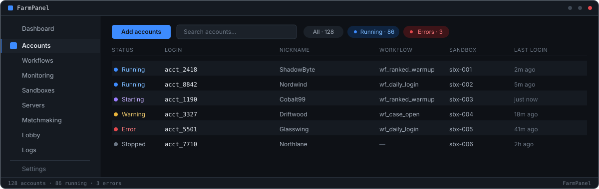

<div align="center">



<br/>

# FARMPANEL

**Steam 与 CS2 账号农场面板 —— 面向 Windows 的多账号编排**

`启动 · 隔离 · 监控 · 恢复`

FarmPanel 是用于大规模运行 **Steam 账号农场**的 Windows 桌面面板。它在一个窗口中，
就能启动、用沙盒隔离、监控并自动重启你农场里的每一个 **CS2 账号**——从五个账号到
数百个——全程无自动搬砖、无脚本机器人。

[**下载 Windows 版**](https://github.com/leryqq/farmpanel-releases/releases/latest) ·
[官网](https://farmpanel.cc) ·
[产品](https://farmpanel.cc/zh/product) ·
[Telegram](https://t.me/farmpanel_cn)

[](https://github.com/leryqq/farmpanel-releases/releases/latest)
[](https://farmpanel.cc)
[](https://github.com/leryqq/farmpanel-releases/releases)
[](https://t.me/farmpanel_cn)

其他语言版本：[English](./README.md) · [Русский](./README.ru.md) · [Español](./README.es.md) · [Português](./README.pt.md) · [Français](./README.fr.md) · [Türkçe](./README.tr.md) · [Bahasa Indonesia](./README.id.md) · [Tiếng Việt](./README.vi.md) · [हिन्दी](./README.hi.md) · [العربية](./README.ar.md)

</div>

---

## 什么是 FarmPanel

如果你同时管理多个 Steam 账号，一定熟悉这样的日常：十几个窗口同时开着，某个 CS2
客户端崩溃了还得你自己发现、手动重开，也没有一个清晰的办法能看出谁卡在加载界面、
谁已经进了对局。农场里的账号越多，这活儿就越折磨人。

**FarmPanel 正是为了消除这种琐事而打造的 Steam 与 CS2 账号农场面板。**它是一款
Windows 桌面应用，在一个窗口中启动、隔离并监控整个多账号农场——是手动管理 Steam
多账号，或拼凑一堆脚本和虚拟机之外的真正替代方案。

FarmPanel **不是自动搬砖机器人**。它不替你玩游戏，也不模拟游戏内操作——它管理的是
游戏*周围*的一切：启动客户端、发送房间邀请、恢复崩溃的会话，并让你实时掌握每个账号
的情况。游戏内的每一个操作都由真人完成，因此你的农场表现得——看起来也——像真实玩家，
因为它本来就是。

```
orchestrator: launch sandbox#42
steam:        client ready (acct_2418)
cs2:          lobby created · slot 1/5
gsi:          match_state = warmup
recovery:     ok · health 1.00
```

## 农场主为什么选择 FarmPanel

**01 —— 绝不自动搬砖。**
FarmPanel 从不替你玩。每一个游戏内操作都由手动完成，所以账号看起来像真人，因为
它们就是。

**02 —— 只需配置一次。**
每次启动和登录都走同一套确定的流程。昨天能跑通的，明天照样能跑通，绝无意外。

**03 —— 崩溃自动修复。**
如果 Steam 或 CS2 挂了，FarmPanel 会察觉并在几秒内无人值守地把它拉起来。

**04 —— 真正的沙盒隔离。**
每个账号都在各自独立的环境中运行——不共享会话、不共享文件、账号之间不会串指纹。

**05 —— 密码绝不离开你的电脑。**
凭据使用 Windows 内置安全机制加密，仅保存在你本机，绝不外发。

**06 —— 每个账号实时可见。**
每个账号一块实时面板：状态、对局状态、运行时长。不必再猜农场在做什么。

**07 —— 每账号独立网络路由。**
为每个账号选择最佳的服务器区域；网络配置交给 FarmPanel。

**08 —— 随农场一起成长。**
从五个账号起步，扩展到数百个。自始至终同一块面板、同一套流程。

## 快速上手

1. 下载安装程序 —— 点击上方 **[下载 Windows 版](https://github.com/leryqq/farmpanel-releases/releases/latest)**，
   或前往本仓库的 [Releases](https://github.com/leryqq/farmpanel-releases/releases) 页面。
2. 运行 `Setup.exe`。FarmPanel 会检查你的系统并引导你完成安装。
3. 添加你的 Steam 账号，启动你的第一个农场。

```
系统要求：  Windows 10/11（64 位）· .NET 8
推荐配置：  32 GB 内存 · SSD · 同时运行 16-32 个 CS2 账号
更新方式：  自动，来自本仓库
```

## 常见问题

**FarmPanel 会替我玩游戏吗？**
不会——这正是关键。没有机器人，也没有自动搬砖。FarmPanel 负责管理账号：启动、监控、
组建房间、修复崩溃。游戏里的一切都由你来做，所以你的账号表现得像真实玩家，因为它们
就是。

**我的密码存在哪里？**
只存在你本机。它们用 Windows 内置安全机制加密，绝不以明文保存，也绝不外发。

**它只支持 CS2 吗？**
目前对 CS2 的支持最深入，包括实时对局遥测。更多游戏正在路上。

**费用是多少？**
价格取决于农场规模。[在 Telegram 上联系我们](https://t.me/farmpanel_cn)，我们会根据
你的配置匹配方案——从小型配置到数百个账号皆可。

更多解答见[产品 FAQ](https://farmpanel.cc/zh/product#faq)。

## 指南与资源

- [如何安全地运行多个 Steam 账号](https://farmpanel.cc/zh/guides/run-multiple-steam-accounts-safely)
- [Steam 账号沙盒详解](https://farmpanel.cc/zh/guides/steam-account-sandboxing)
- [一台电脑能跑多少个 CS2 账号？](https://farmpanel.cc/zh/guides/how-many-cs2-accounts-per-pc)
- [CS2 每周掉落详解](https://farmpanel.cc/zh/guides/cs2-weekly-drop-explained)
- [CS2 多账号封禁风险](https://farmpanel.cc/zh/guides/cs2-multi-account-ban-risks)
- [搬砖 CS2 需要 Prime 账号吗？](https://farmpanel.cc/zh/guides/prime-accounts-for-cs2-farming)
- [CS2 开箱搬砖的经济账](https://farmpanel.cc/zh/guides/cs2-case-farming-economics)
- [出售 CS2 掉落并变现](https://farmpanel.cc/zh/guides/sell-cs2-drops-steam-market)
- [CS2 农场：手动 vs. 面板](https://farmpanel.cc/zh/compare/manual-multi-accounting)

## 链接

| | |
| --- | --- |
| 官网 | [farmpanel.cc](https://farmpanel.cc) |
| 产品 | [farmpanel.cc/zh/product](https://farmpanel.cc/zh/product) |
| 更新日志 | [farmpanel.cc/zh/changelog](https://farmpanel.cc/zh/changelog) |
| Telegram | [t.me/farmpanel_cn](https://t.me/farmpanel_cn) |

---

<div align="center">

本仓库仅分发经过签名的 FarmPanel 二进制文件。
应用程序的源代码为专有且闭源。

`系统状态 · 所有系统运行正常`

**FarmPanel Systems** · 保留所有权利

</div>
