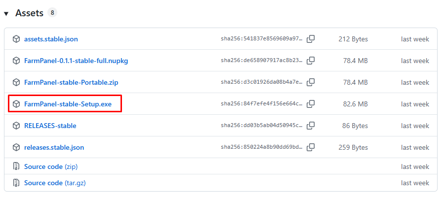
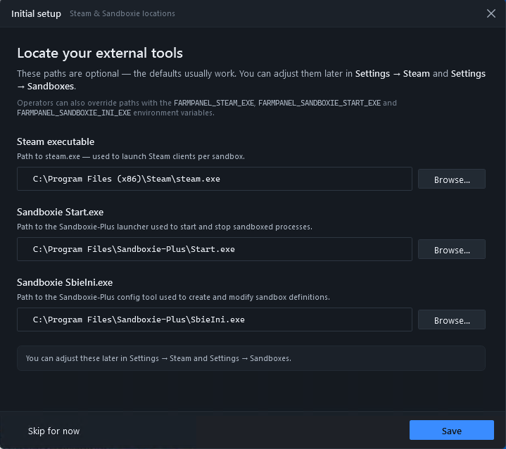
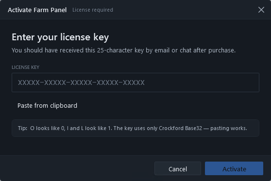
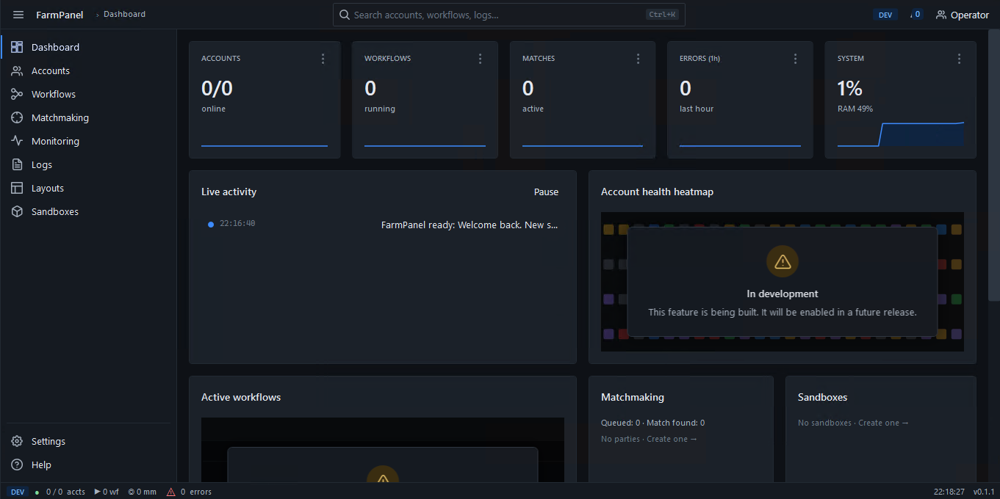

# Pemasangan FarmPanel

**Panduan pemasangan langkah demi langkah untuk Windows**

Versi dokumen: 1.0

🌐 [English](INSTALL-GUIDE.md) · [Русский](INSTALL-GUIDE.ru.md) · [Español](INSTALL-GUIDE.es.md) · [Português](INSTALL-GUIDE.pt.md) · [Français](INSTALL-GUIDE.fr.md) · [Türkçe](INSTALL-GUIDE.tr.md) · **Bahasa Indonesia** · [Tiếng Việt](INSTALL-GUIDE.vi.md) · [हिन्दी](INSTALL-GUIDE.hi.md) · [中文](INSTALL-GUIDE.zh.md) · [العربية](INSTALL-GUIDE.ar.md)

---

Panduan ini membawa Anda dari mengunduh program hingga menjalankannya pertama kali. Ikuti langkah-langkah secara berurutan — tidak rumit, hanya butuh beberapa menit.

> **Singkatnya.** Unduh `Setup.exe` → jalankan → aktifkan lisensi Anda dengan kunci → selesai. Tidak perlu hak administrator, dan tidak ada yang perlu dipasang secara terpisah.

## Daftar isi

1. [Yang Anda perlukan](#1-yang-anda-perlukan)
2. [Persyaratan sistem](#2-persyaratan-sistem)
3. [Langkah 1. Unduh pemasang](#langkah-1-unduh-pemasang)
4. [Langkah 2. Jalankan pemasangan](#langkah-2-jalankan-pemasangan)
5. [Langkah 3. Buka aplikasi](#langkah-3-buka-aplikasi)
6. [Langkah 4. Penyiapan awal — lokasi Steam dan Sandboxie](#langkah-4-penyiapan-awal--lokasi-steam-dan-sandboxie)
7. [Langkah 5. Aktifkan lisensi Anda](#langkah-5-aktifkan-lisensi-anda)
8. [Langkah 6. Pastikan semuanya berfungsi](#langkah-6-pastikan-semuanya-berfungsi)
9. [Pembaruan](#pembaruan)
10. [Cara menghapus instalasi](#cara-menghapus-instalasi)
11. [Mengatasi masalah pemasangan](#mengatasi-masalah-pemasangan)
12. [Pertanyaan umum](#pertanyaan-umum)

---

# 1. Yang Anda perlukan

- **Komputer dengan Windows 10 atau 11** (64-bit).
- **Koneksi internet** — untuk mengunduh program dan mengaktifkan lisensi.
- **Kunci lisensi** — Anda menerimanya saat pembelian. Bentuknya seperti ini:
  `XXXX-XXXX-XXXX-XXXX-XXXX` (lima kelompok empat karakter).
- **Sekitar 10 menit waktu Anda.**

> Anda **tidak perlu** memasang apa pun secara terpisah (seperti .NET) — semua yang diperlukan sudah termasuk dalam pemasang.

---

# 2. Persyaratan sistem

| Item | Minimum | Disarankan |
|---|---|---|
| Sistem operasi | Windows 10 atau 11 (64-bit) | Windows 10 / 11 (64-bit) |
| Memori | 8 GB | 32 GB |
| Disk | Apa saja | SSD |
| Ruang kosong | sekitar 500 MB | 1 GB atau lebih |
| Akun bersamaan | 2 | 4–10 akun CS2 |
| Resolusi layar | lebar minimal 1280 piksel | Full HD (1920×1080) atau lebih tinggi |

Jika komputer Anda memenuhi minimum, aplikasi akan berjalan. Semakin bertenaga komputer Anda, semakin banyak akun yang bisa dijalankan sekaligus.

---

# Langkah 1. Unduh pemasang

1. Buka halaman unduhan resmi:
   **[Unduh untuk Windows](https://github.com/leryqq/farmpanel-releases/releases/latest)**
   (Anda juga bisa menemukan tautan unduhan di situs [farmpanel.cc](https://farmpanel.cc)).
2. Temukan berkas yang bernama seperti **`Setup.exe`** (di bagian **Assets** jika Anda berada di halaman releases) dan klik untuk mengunduh.
3. Tunggu unduhan selesai. Berkasnya sekitar 50–80 MB, jadi pada koneksi cepat butuh kurang dari satu menit.

**Apa yang terjadi berikutnya.** Berkas `Setup.exe` muncul di folder **Unduhan** (Downloads) Anda.

> **Tips.** Unduh pemasang hanya dari halaman resmi yang ditautkan di atas. Dengan begitu Anda mendapatkan versi program yang asli dan terverifikasi.

---

# Langkah 2. Jalankan pemasangan

1. Buka folder **Unduhan** dan klik dua kali berkas **`Setup.exe`**.
2. Pemasangan dimulai otomatis. **Hak administrator tidak diperlukan** — aplikasi dipasang hanya untuk akun pengguna Anda.
3. Tunggu hingga selesai. Ini biasanya butuh kurang dari satu menit. Tidak ada tombol "Berikutnya" terpisah untuk diklik — pemasang melakukan semuanya sendiri.

**Apa yang terjadi berikutnya.** Aplikasi terpasang, dan ikon **FarmPanel** muncul di desktop dan menu Mulai. Aplikasi sering terbuka tepat setelah pemasangan.

> **Jika muncul jendela biru "Windows melindungi PC Anda" (SmartScreen)** — ini peringatan biasa untuk program baru, bukan kesalahan. Yang harus dilakukan:
> 1. Klik **Info selengkapnya**.
> 2. Klik tombol **Tetap jalankan** yang muncul.
>
> Pemasangan berlanjut seperti biasa. Detail lebih lanjut di [Mengatasi masalah pemasangan](#mengatasi-masalah-pemasangan).

---

# Langkah 3. Buka aplikasi

Jika aplikasi tidak terbuka sendiri, klik dua kali ikon **FarmPanel** di desktop atau cari di menu Mulai.

**Apa yang akan Anda lihat.** Pada peluncuran pertama, aplikasi memandu Anda melalui penyiapan awal singkat dan aktivasi lisensi — inilah langkah berikutnya.

---

# Langkah 4. Penyiapan awal — lokasi Steam dan Sandboxie

Pada peluncuran pertama, aplikasi meminta Anda menunjukkan lokasi **Steam** dan **Sandboxie-Plus** di komputer Anda. Tanpa jalur ini, aplikasi tidak dapat meluncurkan dan mengisolasi akun.

> **Penting.** Sandboxie-Plus harus sudah terpasang pada tahap ini. Jika belum, lihat panduan terpisah [Pemasangan Sandboxie-Plus](../install-sandboxie-plus/INSTALL-SANDBOXIE-PLUS.id.md).

1. **Lokasi Steam.** Klik tombol pemilih folder (**Browse…** / ikon folder) di samping kolom Steam dan pilih folder tempat Steam terpasang. Biasanya ini `C:\Program Files (x86)\Steam`.
2. **Lokasi Sandboxie.** Klik tombol pemilih folder di samping kolom Sandboxie dan pilih folder tempat Sandboxie-Plus terpasang. Biasanya ini `C:\Program Files\Sandboxie-Plus`.
3. Konfirmasikan penyiapan (tombol **Save** / **Continue**).

**Apa yang terjadi berikutnya.** Aplikasi mengingat jalur ini dan menggunakannya setiap kali meluncurkan akun.

**Tanda keberhasilan.** Kedua jalur sudah diatur, dan aplikasi tidak menampilkan peringatan bahwa Steam atau Sandboxie tidak ditemukan.

> **Tips.** Anda dapat mengubah jalur ini nanti kapan saja di **Settings** (Pengaturan).

---

# Langkah 5. Aktifkan lisensi Anda

Aktivasi hanya diperlukan sekali — pada peluncuran pertama.

1. Ketik atau tempel kunci lisensi Anda ke kolom masukan.
   Untuk menempel dari papan klip, klik **Paste from clipboard** (Tempel dari papan klip).
2. Aplikasi memeriksa format kunci saat Anda mengetik. Ketika formatnya benar, tombol aktivasi menjadi tersedia.
3. Klik **Activate** (Aktifkan).

**Apa yang terjadi berikutnya.** Aplikasi menghubungi server dan memverifikasi kunci. Ini butuh beberapa detik — Anda akan melihat status **Activating** (Mengaktifkan).

**Tanda keberhasilan.** Jendela aktivasi tertutup dan layar utama aplikasi — **Dashboard** — terbuka. Lisensi Anda aktif. Anda tidak perlu memasukkan kunci lagi pada peluncuran berikutnya.

> **Jika kunci tidak diterima** — pastikan Anda memasukkannya tanpa salah ketik (lebih mudah menempelnya dengan **Paste from clipboard**) dan Anda memiliki internet. Pesan-pesan umum dibahas di [Mengatasi masalah pemasangan](#mengatasi-masalah-pemasangan).

---

# Langkah 6. Pastikan semuanya berfungsi

Setelah aktivasi, Anda tiba di layar utama. Pastikan pemasangan berhasil:

1. Di bagian atas jendela terlihat **bilah samping** dengan berbagai bagian (**Dashboard**, **Accounts**, **Workflows**, dan lainnya).
2. Di bagian bawah jendela ada **bilah status** — pita tipis dengan ringkasan dan versi aplikasi (misalnya, `v1.0.1`).
3. Aplikasi terbuka dan berpindah antar-bagian tanpa kesalahan.

Jika semua ini ada — **pemasangan selesai dan Anda bisa mulai menggunakan aplikasi**.

**Selanjutnya.** Tambahkan akun Steam Anda dan jalankan farm pertama Anda. Untuk instruksi langkah demi langkah, lihat [Panduan Pengguna](../user-guide/USER-GUIDE.id.md) (bagian “Alur kerja utama”).

---

# Pembaruan

FarmPanel diperbarui **secara otomatis** — Anda tidak perlu mengunduh apa pun secara manual.

- Aplikasi memeriksa versi baru saat mulai dan sesekali selama berjalan.
- Versi baru diunduh diam-diam, di latar belakang, tanpa mengganggu pekerjaan Anda.
- Pembaruan diterapkan saat aplikasi dimulai ulang berikutnya.

**Yang Anda lakukan.** Tidak ada yang khusus. Cukup tutup dan buka kembali aplikasi sesekali, dan versi terbaru akan terpasang. Versi saat ini selalu terlihat di bilah status di bagian bawah dan di **Settings → About** (Pengaturan → Tentang).

---

# Cara menghapus instalasi

Jika Anda perlu menghapus FarmPanel:

1. Buka **Pengaturan Windows** → **Aplikasi** → **Aplikasi terpasang**
   (atau “Control Panel” → “Programs and Features”).
2. Temukan **FarmPanel** dalam daftar.
3. Klik **Uninstall** dan konfirmasikan.

**Apa yang terjadi berikutnya.** Aplikasi dihapus dari komputer Anda. Hak administrator tidak diperlukan untuk menghapus instalasi.

---

# Mengatasi masalah pemasangan

Berikut situasi umum dan apa yang harus dilakukan.

## Muncul jendela "Windows melindungi PC Anda" (SmartScreen)

**Penyebab.** Windows menampilkan peringatan ini untuk program yang baru diunduh dan belum dikenal luas oleh sistem. Ini tidak berarti ada yang salah dengan berkasnya.

**Solusi.**
1. Klik **Info selengkapnya**.
2. Klik **Tetap jalankan**.

Pemasangan berlanjut. Jika tidak ada tombol **Info selengkapnya**, pastikan Anda mengunduh berkas dari halaman resmi lalu coba lagi.

## Antivirus memblokir atau menghapus berkas

**Penyebab.** Beberapa antivirus bersikap hati-hati terhadap pemasang baru dan bisa memberi peringatan palsu.

**Solusi.**
1. Pastikan Anda mengunduh `Setup.exe` dari halaman resmi (tautan ada di [Langkah 1](#langkah-1-unduh-pemasang)).
2. Jika perlu, tambahkan berkas ke pengecualian antivirus dan unduh lagi.
3. Jika ragu, hubungi dukungan (lihat [Pertanyaan umum](#pertanyaan-umum)).

## Peramban tidak mengizinkan mengunduh berkas

**Penyebab.** Peramban juga bisa berhati-hati saat mengunduh berkas `.exe`.

**Solusi.** Di panel unduhan peramban, pilih **Simpan** (Keep) di samping berkas. Setelah itu unduhan akan selesai.

## Pemasang tidak mulai saat diklik dua kali

**Solusi.**
- Pastikan berkas terunduh sepenuhnya (sekitar 50–80 MB).
- Klik kanan berkas dan pilih **Buka**.
- Unduh ulang pemasang jika berkasnya rusak.

## Kunci lisensi tidak diterima

| Pesan | Artinya | Yang harus dilakukan |
|---|---|---|
| “License key invalid” | Kunci dimasukkan dengan salah ketik | Periksa ejaannya. Lebih mudah menempel kunci dengan **Paste from clipboard** |
| “Used on max devices” | Lisensi sudah dipakai pada jumlah perangkat maksimum | Bebaskan lisensi di perangkat lain, lalu coba lagi. Tombol **Manage devices** mengarah ke pengelolaan perangkat |
| “Cannot reach license server” | Tidak ada koneksi ke server | Periksa koneksi internet Anda dan klik **Retry** |

## Aplikasi tidak terbuka setelah pemasangan

**Solusi.**
- Buka secara manual: ikon **FarmPanel** di desktop atau di menu Mulai.
- Mulai ulang komputer dan coba lagi.
- Jika tidak membantu, pasang ulang aplikasi: hapus instalasinya (lihat [Cara menghapus instalasi](#cara-menghapus-instalasi)) lalu pasang kembali.

---

# Pertanyaan umum

**Apakah saya perlu hak administrator untuk memasang?**
Tidak. FarmPanel dipasang hanya untuk akun pengguna Anda dan tidak memerlukan hak administrator.

**Apakah saya perlu memasang .NET atau komponen lain secara terpisah?**
Tidak. Semua yang diperlukan sudah termasuk dalam pemasang — cukup jalankan `Setup.exe`.

**Di mana aplikasi dipasang?**
Di folder pengguna pribadi Anda. Anda tidak perlu memilih folder secara manual — pemasang mengurusnya.

**Apakah aman mengklik "Tetap jalankan" di jendela SmartScreen?**
Ya, jika Anda mengunduh `Setup.exe` dari halaman resmi yang tercantum dalam panduan ini. Peringatan muncul hanya karena program masih baru bagi sistem.

**Di mana kata sandi saya disimpan setelah pemasangan?**
Hanya di komputer Anda. Kata sandi dienkripsi dengan proteksi bawaan Windows, tidak pernah disimpan sebagai teks biasa, dan tidak pernah dikirim ke mana pun.

**Apakah saya harus memasukkan kunci lisensi setiap kali?**
Tidak. Kunci dimasukkan sekali saja, saat aktivasi pertama. Setelah itu aplikasi langsung terbuka ke layar utama.

**Bagaimana cara memperbarui aplikasi ke versi baru?**
Tidak ada yang perlu dilakukan — FarmPanel diperbarui otomatis. Cukup mulai ulang aplikasi sesekali agar versi terbaru terpasang (lihat [Pembaruan](#pembaruan)).

**Ke mana saya menghubungi jika ada yang tidak berhasil?**
Hubungi dukungan di Telegram: [t.me/farmpanel_id](https://t.me/farmpanel_id). Jelaskan masalahnya dan, jika ada, sertakan teks pesan kesalahan.

---

Setelah pemasangan, lanjut ke [Panduan Pengguna](../user-guide/USER-GUIDE.id.md) — panduan itu menjelaskan secara rinci cara menambah akun, menjalankannya, dan bekerja dengan aplikasi.

*Akhir panduan pemasangan FarmPanel.*
