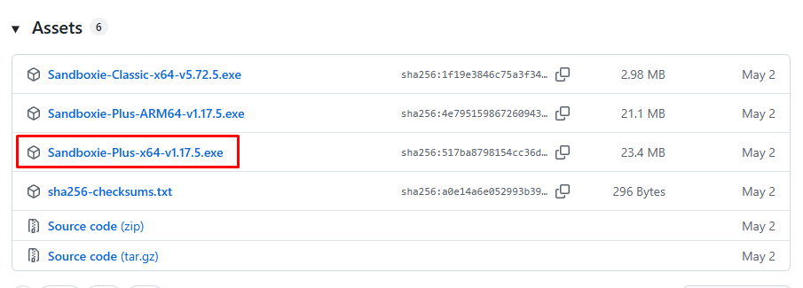
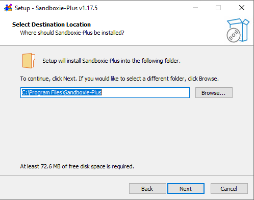
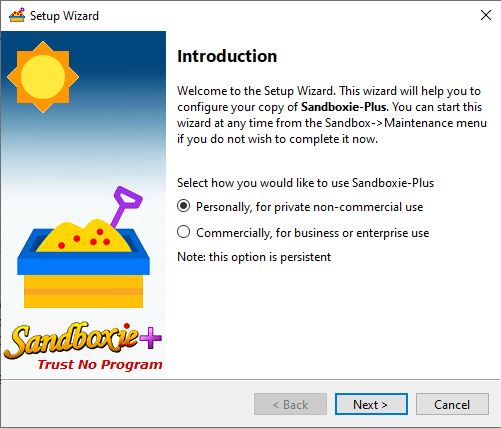
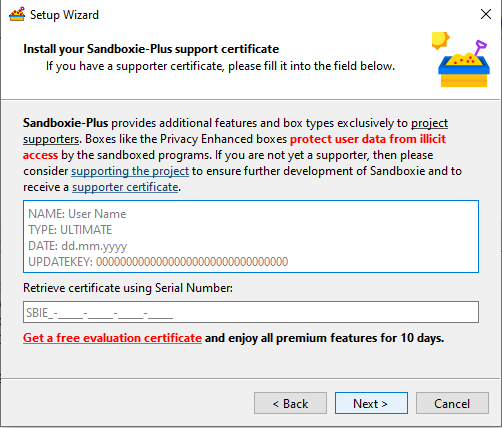
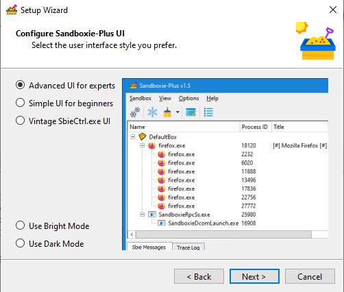
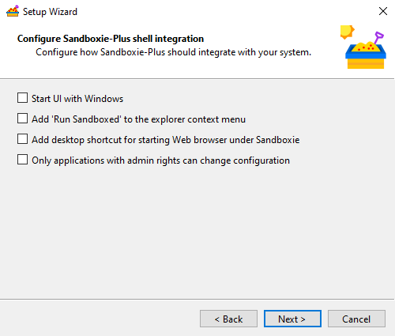
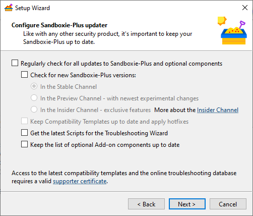
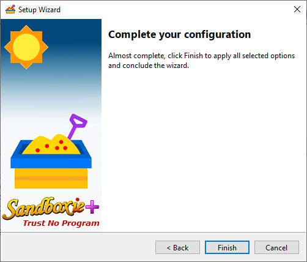
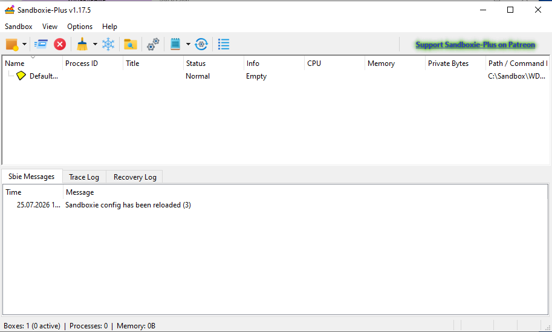

# Pemasangan Sandboxie-Plus

**Panduan pemasangan langkah demi langkah untuk Windows**

Versi dokumen: 1.0 · Versi Sandboxie-Plus: **1.17.5**

🌐 [English](INSTALL-SANDBOXIE-PLUS.md) · [Русский](INSTALL-SANDBOXIE-PLUS.ru.md) · [Español](INSTALL-SANDBOXIE-PLUS.es.md) · [Português](INSTALL-SANDBOXIE-PLUS.pt.md) · [Français](INSTALL-SANDBOXIE-PLUS.fr.md) · [Türkçe](INSTALL-SANDBOXIE-PLUS.tr.md) · **Bahasa Indonesia** · [Tiếng Việt](INSTALL-SANDBOXIE-PLUS.vi.md) · [हिन्दी](INSTALL-SANDBOXIE-PLUS.hi.md) · [中文](INSTALL-SANDBOXIE-PLUS.zh.md) · [العربية](INSTALL-SANDBOXIE-PLUS.ar.md)

---

FarmPanel menjaga setiap akun di dalam **sandbox**-nya sendiri — sebuah lingkungan terisolasi tempat Steam dan CS2 tidak bercampur dengan akun lain. Isolasi ini ditangani oleh program gratis bernama **Sandboxie-Plus**. Anda memasangnya satu kali, sebelum mulai menjalankan akun di FarmPanel.

Panduan ini memandu Anda melalui pemasangan langkah demi langkah. Tidak rumit — hanya butuh beberapa menit.

> **Singkatnya.** Unduh pemasang **Sandboxie-Plus 1.17.5** → jalankan → terima pengaturan default → izinkan pemasangan (diperlukan hak administrator) → selesai.

> **Penting.** Berbeda dengan FarmPanel sendiri, Sandboxie-Plus **memerlukan hak administrator** untuk dipasang — ini normal, karena program ini terintegrasi dalam ke Windows untuk mengisolasi aplikasi dengan andal.

## Daftar isi

1. [Yang Anda perlukan](#1-yang-anda-perlukan)
2. [Langkah 1. Unduh pemasang](#langkah-1-unduh-pemasang)
3. [Langkah 2. Jalankan pemasangan](#langkah-2-jalankan-pemasangan)
4. [Langkah 3. Ikuti wizard pemasangan](#langkah-3-ikuti-wizard-pemasangan)
5. [Langkah 4. Peluncuran pertama Sandboxie-Plus](#langkah-4-peluncuran-pertama-sandboxie-plus)
6. [Langkah 5. Pastikan semuanya berfungsi](#langkah-5-pastikan-semuanya-berfungsi)
7. [Langkah 6. Hubungkan ke FarmPanel](#langkah-6-hubungkan-ke-farmpanel)
8. [Cara menghapus Sandboxie-Plus](#cara-menghapus-sandboxie-plus)
9. [Mengatasi masalah](#mengatasi-masalah)
10. [Pertanyaan umum](#pertanyaan-umum)

---

# 1. Yang Anda perlukan

- **Komputer dengan Windows 10 atau 11** (64-bit).
- **Hak administrator** di komputer ini (sebuah dialog muncul saat pemasangan — Anda perlu mengklik **Ya**).
- **Koneksi internet** — untuk mengunduh program.
- **Sekitar 5 menit waktu Anda.**

> Sandboxie-Plus gratis. Beberapa fitur tambahan tersedia bagi yang mendukung proyek, tetapi Anda **tidak memerlukannya** untuk bekerja dengan FarmPanel — versi gratis biasa sudah cukup.

---

# Langkah 1. Unduh pemasang

1. Buka halaman resmi untuk versi yang Anda perlukan:
   **[Sandboxie-Plus 1.17.5 di GitHub](https://github.com/sandboxie-plus/Sandboxie/releases/tag/v1.17.5)**
2. Gulir ke bawah ke bagian **Assets**.
3. Temukan dan unduh berkas yang bernama seperti **`Sandboxie-Plus-x64-v1.17.5.exe`** — ini adalah pemasang untuk Windows 64-bit biasa.

**Cara memilih berkas yang tepat:**

| Berkas | Untuk siapa |
|---|---|
| **`Sandboxie-Plus-x64-v1.17.5.exe`** | **Sebagian besar pengguna** — Windows biasa pada prosesor Intel atau AMD. Unduh yang ini. |
| `Sandboxie-Plus-arm64-v1.17.5.exe` | Hanya untuk komputer dengan prosesor ARM (jarang). |
| `Sandboxie-Classic-…` | Varian antarmuka lama. **Tidak diperlukan** untuk FarmPanel — pilih **Plus**. |
| Berkas `.7z` | Versi portabel untuk pengguna tingkat lanjut. **Tidak diperlukan** untuk pemasangan. |

**Apa yang terjadi berikutnya.** Berkas muncul di folder **Unduhan** (Downloads) Anda.

> **Tips.** Unduh pemasang hanya dari halaman GitHub resmi yang ditautkan di atas. Dengan begitu Anda mendapatkan versi yang asli dan terverifikasi.

---

# Langkah 2. Jalankan pemasangan

1. Buka folder **Unduhan** dan klik dua kali berkas **`Sandboxie-Plus-x64-v1.17.5.exe`** yang sudah diunduh.
2. Windows menampilkan dialog **“Apakah Anda ingin mengizinkan aplikasi ini membuat perubahan pada perangkat Anda?”** — klik **Ya**. Ini adalah dialog hak administrator; tanpanya, Sandboxie-Plus tidak dapat dipasang.

> **Jika muncul jendela biru SmartScreen** (“Windows melindungi PC Anda”) — klik **Info selengkapnya**, lalu **Tetap jalankan**. Ini peringatan biasa untuk program yang diunduh, bukan kesalahan.

**Apa yang terjadi berikutnya.** Jendela wizard pemasangan terbuka.

---

# Langkah 3. Ikuti wizard pemasangan

Wizard pemasangan memandu Anda melalui beberapa layar sederhana. Dalam kebanyakan kasus, Anda cukup membiarkan semuanya pada nilai default dan mengklik **Next**.

1. **Pemilihan bahasa.** Jika muncul jendela pemilihan bahasa, pilih bahasa Indonesia (atau bahasa Anda) lalu klik **OK**.
2. **Perjanjian lisensi.** Baca lalu klik **I Agree** atau **Next**.
3. **Folder pemasangan.** Biarkan folder default (`C:\Program Files\Sandboxie-Plus`) lalu klik **Next**. Tidak perlu mengubahnya.
4. **Opsi pemasangan.** Tidak ada yang perlu diubah — cukup klik **Next** / **Install**.
5. Tunggu hingga selesai. Pemasangan butuh kurang dari satu menit.
6. Di layar terakhir, klik **Finish**. Biarkan kotak “jalankan Sandboxie-Plus” tercentang, jika ada.

**Apa yang terjadi berikutnya.** Sandboxie-Plus terpasang, dan ikonnya muncul di desktop dan menu Mulai. Program biasanya terbuka tepat setelah pemasangan.

> **Perlu memulai ulang?** Biasanya tidak. Tetapi jika wizard meminta memulai ulang komputer, lakukanlah, agar isolasi berfungsi dengan benar.

---

# Langkah 4. Peluncuran pertama Sandboxie-Plus

Saat pertama kali membuka Sandboxie-Plus, ia menampilkan sebuah **Setup Wizard** (wizard penyiapan). Ikuti langkah demi langkah — cukup ulangi yang dijelaskan di bawah.

Jika jendela **pemilihan bahasa antarmuka** muncul sebelum wizard, pilih bahasa Anda lalu klik **OK**.

Wizard kemudian memandu Anda melalui beberapa layar.

### Layar 1 — Introduction

Pilih **“Personally, for private non-commercial use”** (Pribadi, untuk penggunaan non-komersial) lalu klik **Next**.

### Layar 2 — Support certificate

Biarkan kolomnya **kosong** lalu klik **Next**. Sertifikat tidak diperlukan untuk bekerja dengan FarmPanel.

### Layar 3 — Configure UI

Biarkan nilainya pada **default** (**Advanced UI for experts** sudah terpilih) lalu klik **Next**.

### Layar 4 — Shell integration

**Hapus centang semua kotak** lalu klik **Next**.

### Layar 5 — Updater

**Hapus centang semua kotak** lalu klik **Next**.

### Layar 6 — Complete

Klik **Finish** untuk menerapkan pengaturan dan menutup wizard.

> **Tips.** Jika ragu di layar mana pun, hapus centang kotak-kotaknya dan klik **Next**. FarmPanel tidak memerlukan integrasi tambahan atau pengingat pembaruan.

**Apa yang terjadi berikutnya.** Jendela utama Sandboxie-Plus terbuka — daftar sandbox dan panel kontrol.

---

# Langkah 5. Pastikan semuanya berfungsi

Pastikan Sandboxie-Plus terpasang dengan benar:

1. Buka Sandboxie-Plus (ikon di desktop atau di menu Mulai).
2. Jendela utama menampilkan daftar sandbox — biasanya ada sandbox default dengan nama seperti **DefaultBox**.
3. Program terbuka dan tidak menampilkan pesan kesalahan.

Jika semua ini ada — **Sandboxie-Plus terpasang dan siap digunakan**.

---

# Langkah 6. Hubungkan ke FarmPanel

Setelah Sandboxie-Plus terpasang, FarmPanel dapat menggunakannya untuk mengisolasi akun.

1. Buka **FarmPanel**.
2. Buka **Settings → Sandboxes**.
3. Pastikan jalur folder sandbox sudah diatur. Jika kolomnya kosong, pilih folder untuk sandbox; jika sudah terisi, tidak ada yang perlu diubah.
4. Kembali ke layar **Accounts**. Sekarang, saat menambah akun, Anda bisa memilih cara sandbox diberikan (**Auto-assign** dan lainnya), dan akun bisa dijalankan.

> **Bagaimana ini terhubung.** Di FarmPanel, setiap akun harus terhubung ke sebuah sandbox, jika tidak akun tidak bisa dijalankan. Sandboxie-Plus-lah yang membuat dan memelihara lingkungan terisolasi ini “di balik layar”. Untuk lebih lanjut tentang sandbox dan menjalankan akun, lihat [Panduan Pengguna FarmPanel](../user-guide/USER-GUIDE.id.md).

**Tanda keberhasilan.** Sebuah akun di FarmPanel berjalan dan berpindah ke status **Running** — yang berarti isolasi melalui Sandboxie-Plus berfungsi.

---

# Cara menghapus Sandboxie-Plus

Jika Anda perlu menghapus program:

1. Pertama, tutup semua program yang berjalan di sandbox (di FarmPanel, hentikan akun dengan **Stop**).
2. Buka **Pengaturan Windows** → **Aplikasi** → **Aplikasi terpasang**
   (atau “Control Panel” → “Programs and Features”).
3. Temukan **Sandboxie-Plus** dalam daftar.
4. Klik **Uninstall** dan konfirmasikan. Hak administrator juga diperlukan untuk menghapus.

> **Catatan.** Setelah Sandboxie-Plus dihapus, FarmPanel tidak bisa menjalankan akun sampai program dipasang lagi.

---

# Mengatasi masalah

## Windows tidak mengizinkan pemasangan — tidak ada hak administrator

**Penyebab.** Sandboxie-Plus benar-benar memerlukan hak administrator.

**Solusi.** Masuk dengan akun yang memiliki hak administrator, atau minta administrator komputer memasang program. Ketika muncul dialog **“Izinkan perubahan?”**, klik **Ya**.

## Muncul jendela SmartScreen

**Penyebab.** Windows memperingatkan tentang program yang baru diunduh. Ini bukan kesalahan.

**Solusi.** Klik **Info selengkapnya**, lalu **Tetap jalankan**.

## Antivirus memblokir pemasang

**Penyebab.** Beberapa antivirus bersikap hati-hati terhadap perangkat lunak yang terintegrasi ke sistem.

**Solusi.**
1. Pastikan Anda mengunduh berkas dari halaman GitHub resmi (tautan ada di [Langkah 1](#langkah-1-unduh-pemasang)).
2. Jika perlu, tambahkan sementara berkas ke pengecualian antivirus dan unduh lagi.

## Mengunduh berkas yang salah

**Penyebab.** Ada beberapa berkas di halaman release.

**Solusi.** Untuk Windows biasa, Anda perlu berkas bernama **`Sandboxie-Plus-x64-v1.17.5.exe`**. Jangan ambil varian **arm64**, **Classic**, atau **.7z**. Kembali ke [Langkah 1](#langkah-1-unduh-pemasang) dan unduh berkas yang benar.

## FarmPanel tidak menjalankan akun setelah pemasangan

**Solusi.**
1. Pastikan Sandboxie-Plus terpasang dan terbuka (lihat [Langkah 5](#langkah-5-pastikan-semuanya-berfungsi)).
2. Di FarmPanel, buka **Settings → Sandboxes** dan periksa apakah jalur folder sandbox sudah diatur.
3. Mulai ulang FarmPanel.
4. Jika masalah berlanjut, hubungi dukungan (lihat [Pertanyaan umum](#pertanyaan-umum)).

## Komputer meminta memulai ulang setelah pemasangan

**Solusi.** Mulai ulang komputer — ini menyelesaikan pemasangan dan mengaktifkan isolasi. Setelah memulai ulang, buka FarmPanel lagi.

---

# Pertanyaan umum

**Apakah memasang Sandboxie-Plus wajib?**
Ya, jika Anda ingin menjalankan akun di FarmPanel. Sandboxie-Plus-lah yang menyediakan isolasi setiap akun di lingkungan terpisah.

**Apakah Sandboxie-Plus berbayar?**
Tidak, versi dasarnya gratis dan cukup untuk bekerja dengan FarmPanel. Fitur tambahan tersedia bagi yang mendukung proyek, tetapi tidak wajib.

**Mengapa pemasangan memerlukan hak administrator sedangkan FarmPanel tidak?**
Sandboxie-Plus terintegrasi dalam ke Windows untuk mengisolasi program dengan andal, jadi ia butuh hak administrator. FarmPanel, sebaliknya, dipasang hanya untuk akun pengguna Anda dan tidak memerlukannya.

**Apakah saya perlu mengonfigurasi sandbox sendiri?**
Tidak. Cukup pasang Sandboxie-Plus. FarmPanel membuat dan mengonfigurasi sandbox untuk akun secara otomatis.

**Apakah saya perlu sertifikat pendukung (supporter certificate)?**
Tidak. Anda bisa melewati layar itu pada peluncuran pertama. Ini tidak diperlukan untuk FarmPanel.

**Versi mana persisnya yang harus saya pasang?**
Versi **1.17.5** — tautannya ada di [Langkah 1](#langkah-1-unduh-pemasang). Pasang persis versi ini untuk kompatibilitas yang dapat diprediksi dengan FarmPanel.

**Ke mana saya menghubungi jika ada yang tidak berhasil?**
Hubungi dukungan FarmPanel di Telegram: [t.me/farmpanel_id](https://t.me/farmpanel_id). Jelaskan masalahnya dan sertakan teks pesan kesalahan jika ada.

---

Setelah memasang Sandboxie-Plus, kembali ke [panduan pemasangan FarmPanel](../install-guide/INSTALL-GUIDE.id.md) atau langsung ke [Panduan Pengguna](../user-guide/USER-GUIDE.id.md) untuk menambah akun dan menjalankan farm pertama Anda.

*Akhir panduan pemasangan Sandboxie-Plus.*
